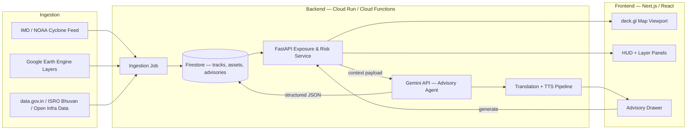

# Product Requirement Document
## Track-Based Cyclone Impact & Infrastructure Vulnerability Forecaster

| Field | Value |
|---|---|
| Track | 05 — Resilience (hack2skill, "Code for Communities 2.0") |
| Document status | Draft v1.0 — hackathon-ready |
| Owner | Product / Geospatial Solutions |
| Mandatory constraint | Solution **must** integrate Google AI (GenAI, predictive modelling, or computer vision) |
| Submission package | GitHub repo, 3–5 min demo video, 10–12 slide pitch deck, 2–3 line description, live deployed link |

---

## 0. Reading This Document — Scope Reality Check

Before the detailed sections: the source challenge brief asks for storm-surge simulation, rainfall-damage-pathway prediction, full critical-infrastructure exposure mapping, and automated multilingual advisory dispatch, in what is realistically a **48–72 hour build window**. Some of that is a multi-year civil-engineering research problem (physics-based storm surge modelling is what agencies like INCOIS run supercomputers for). Overpromising this in a pitch deck is a fast way to lose credibility with judges who know the domain.

This PRD is written around a deliberate substitution: **wherever true physical simulation isn't feasible, replace it with a transparent, rule-based or ML-lite approximation, and say so explicitly in the UI ("estimated model," "illustrative severity," "based on historical proxy").** That's what makes this an honest hackathon prototype instead of a fragile lie. Section 7 gives the exact must-have vs. nice-to-have vs. roadmap cut.

---

## 1. Executive Summary & Problem Statement

### 1.1 Problem
Coastal India (Odisha, West Bengal, Andhra Pradesh, Tamil Nadu, parts of Andhra/AP-Telangana border) sits in the direct path of Bay of Bengal cyclones. Current disaster response is largely **reactive**: agencies mobilize resources after IMD issues a cyclone warning, and infrastructure damage assessment happens post-landfall. This costs lives, delays power/road restoration, and makes insurance payouts slow.

### 1.2 Opportunity
Shift the decision window left — from "what happened" to "what's about to happen, to what, and how badly." A platform that fuses live cyclone track data, satellite-derived terrain/land-cover data, and a geo-tagged infrastructure registry can give district-level authorities a **ranked, explainable list of what to protect first**, hours to days before landfall.

### 1.3 Product Vision (one sentence)
A single glassmorphic geospatial console where a District Collector can scrub a cyclone's forecast track forward in time and instantly see which power substations, roads, health centres, and shelters fall inside the danger cone — with an AI-drafted, voice-ready evacuation advisory one click away.

### 1.4 Goals for the Hackathon Build
1. Demonstrate a believable, end-to-end anticipatory-governance workflow (not a static dashboard).
2. Prove real Google AI integration — Gemini producing structured, grounded advisory text, not decorative chat.
3. Prove real geospatial competence — actual GEE layers or a credible substitute, actual lat/long infrastructure data, not scattered random markers.
4. Ship something that is **live and clickable** for judges, matching the "deployed link" submission requirement.

### 1.5 Explicit Non-Goals (say this in the pitch deck — it builds trust)
- Not a replacement for IMD's official cyclone forecasting — track data is *ingested*, not generated.
- Not a certified structural/engineering damage predictor — surge/runoff output is a risk-ranking heuristic, not a survey-grade simulation.
- Not built for real-time citizen-scale traffic (auth-gated to officials in v1; public SMS/IVR fan-out is roadmap).

---

## 2. User Personas & Key Workflows

| Persona | Role | Primary need | Device context |
|---|---|---|---|
| **State Disaster Management Authority (SDMA) Officer** | Control-room, state-level | Bird's-eye view of all active cyclone threats across the state's coastline; compare districts by exposure score | Large screen, control room, wall display |
| **District Collector / District Magistrate** | District-level decision-maker | Drill into their district, see which shelters/roads/substations are in the cone at T-24h/T-48h, issue an advisory | Laptop, sometimes tablet, intermittent connectivity |
| **Municipal Response Team Lead** | Ward/block-level execution | Get the dispatched advisory in their language, know which shelters in their ward need pre-positioning of resources | Mobile-first, may be in field |

### 2.1 Key Workflow — "Golden Path" (this is what the demo video should show)

1. **Auth** — Officer signs in with Google (role auto-detected or self-selected at first login: SDMA / District / Municipal).
2. **Landing** — Splash screen → map flies in centered on the officer's jurisdiction, active cyclone(s) shown as a pulsing track icon if one exists.
3. **Situational awareness** — HUD shows: cyclone name, current category, distance to coast, ETA to landfall.
4. **Scrub the timeline** — Officer drags the timeline scrubber from "now" to "+48h." The forecast cone visually grows/moves; storm-surge shading and infrastructure markers update live.
5. **Inspect exposure** — Officer taps a clustered marker (e.g., "14 substations in surge zone") → side panel lists each asset with a computed risk score.
6. **Generate advisory** — Officer clicks "Generate Advisory." Gemini ingests the current view state (cone geometry, exposed-asset list, category, timeframe) and returns a structured advisory: headline, affected wards, recommended actions, evacuation priority list.
7. **Localize & dispatch** — Officer picks target language(s) (or "all coastal languages"); system translates and generates TTS audio; officer hits "Dispatch" (in the prototype, this can log to Firestore / show a "sent" state rather than a real SMS gateway — call this out as simulated in the demo).

---

## 3. UI/UX Specifications & Component Architecture

### 3.1 Splash Screen Mechanics
- Duration: **1.8–2.4s hard cap** — a hackathon judge will not wait longer.
- Visual: centered animated glyph (a simplified cyclone-spiral mark, Material You color motion — hue drifting through the primary palette), app name fading in beneath at 60% through the animation.
- Exit transition: radial scale + opacity fade of the splash layer while the map canvas underneath fades/scales in simultaneously (150–250ms overlap) — avoids the "blank flash" between splash and app shell.
- Implementation note: don't block on real data for the splash duration; kick off auth-check and initial map tile fetch in parallel, and if data isn't ready when the animation timer ends, show the shell with skeleton loaders rather than holding the splash longer.

### 3.2 Auth Gateway
- **Method**: Firebase Auth with Google provider only (`signInWithPopup` / `signInWithRedirect` for mobile).
- **Role resolution**: on first login, a lightweight onboarding step asks "Which authority do you represent?" (SDMA / District / Municipal + district/ward picker). This writes a `role` + `jurisdiction` field to the user's Firestore profile document. Subsequent logins skip this and route directly to the jurisdiction-scoped view.
- **Access shaping**: SDMA sees the full state; District/Municipal views are pre-filtered (map bounds + infrastructure queries) to their jurisdiction — this is a *view filter*, not a hard security boundary, for hackathon scope (see Section 4 acceptance criteria for what "restrict" means at MVP vs. roadmap).
- **Onboarding carousel** (3 cards, skippable): (1) "Scrub the timeline to see forecast exposure," (2) "Tap any cluster for asset-level risk," (3) "Generate and dispatch advisories in one click."

### 3.3 Geospatial Viewport Layout

```
┌─────────────────────────────────────────────────────────────┐
│  [search/coord bar]                    [role badge] [avatar] │
│                                                                │
│   ┌──────────┐                                  ┌──────────┐ │
│   │  LAYERS  │        FULL-BLEED MAP            │   HUD    │ │
│   │  toggle  │      (deck.gl / Maps 3D)          │  panel   │ │
│   │  panel   │                                   │ (cyclone │ │
│   │(glass)   │                                   │  stats,  │ │
│   └──────────┘                                   │ exposure │ │
│                                                   │  count)  │ │
│                                                                │
│         ┌─────────────────────────────────────────────┐      │
│         │        TIMELINE SCRUBBER (T-72h → T+24h)      │      │
│         │   ●───────●───────◉───────●───────●          │      │
│         └─────────────────────────────────────────────┘      │
└─────────────────────────────────────────────────────────────┘
```

- **Layer toggle panel** (left, floating glassmorphic card, collapsible): Cyclone track & cone, Storm surge estimate, Rainfall/runoff estimate, Power grid, Roads, Health centres, Cyclone shelters, Satellite (GEE) basemap layer.
- **HUD panel** (right): live-updating counters bound to the scrubber position — "Category," "Hours to landfall," "Assets in cone: N," "Population in surge zone (estimate)." Numbers should visibly change as the scrubber moves — this is the single most "wow" interaction for a judge.
- **Timeline scrubber** (bottom): draggable handle, tick marks per 6h, a "Now" marker fixed, play/pause button that auto-advances at ~1 tick/second for the demo video.
- **Micro-animations**: cone geometry morphs (not snaps) between timeline positions using eased interpolation (~300–400ms ease-out); marker clusters count up/down with a number-roll animation rather than instant swap; layer toggle uses a soft opacity+blur cross-fade.

### 3.4 Component Architecture (React tree, indicative)

```
<App>
 ├─ <SplashScreen />
 ├─ <AuthGate>                    // Firebase Auth wrapper, redirects if unauth'd
 │   └─ <OnboardingCarousel />    // first-login only
 ├─ <AppShell>
 │   ├─ <TopBar>
 │   │   ├─ <SearchCoordBar />
 │   │   └─ <UserBadge />
 │   ├─ <MapViewport>             // deck.gl canvas + Google Maps/GEE tiles
 │   │   ├─ <CycloneConeLayer />
 │   │   ├─ <StormSurgeLayer />
 │   │   ├─ <InfrastructureLayer />
 │   │   └─ <ClusterPopover />
 │   ├─ <LayerTogglePanel />      // glassmorphic, floating left
 │   ├─ <HUDPanel />              // glassmorphic, floating right
 │   ├─ <TimelineScrubber />      // bottom, controls global `timeOffset` state
 │   └─ <AdvisoryDrawer>          // slides up from bottom on "Generate Advisory"
 │       ├─ <AdvisoryText />      // Gemini structured output, rendered
 │       ├─ <LanguageSelector />
 │       └─ <DispatchButton />
```

State management note: a single `timeOffset` value (hours from now, e.g., -72 to +24) should be the source of truth that the scrubber, cone layer, surge layer, and HUD counters all subscribe to — this keeps the "everything updates together" feel that sells the demo.

---

## 4. Functional Requirements & Feature Breakdown

Priority key: **P0** = must work in the demo, **P1** = strong differentiator if time allows, **P2** = pitch-deck roadmap only.

| ID | Requirement | Acceptance Criteria | Priority |
|---|---|---|---|
| FR-1 | Cyclone track ingestion | Given a cyclone is active, the system fetches/parses current position, category, forecast cone (lat/long polygon or points) from a real or cached IMD/NOAA-format feed and renders it on the map within 3s of load. If no live cyclone exists at demo time, a seeded historical or synthetic cyclone dataset can be loaded via a "Simulate Cyclone" demo mode — **this must be clearly labeled as demo/historical data in the UI.** | P0 |
| FR-2 | GEE / satellite basemap layer | At least one Earth-Engine-derived layer (e.g., land cover, elevation, or recent cloud/rainfall imagery) is toggleable on the map and visibly distinct from the base street/satellite map. | P0 |
| FR-3 | Storm surge — risk-band estimate | Given cyclone category + track + coastal distance, the system computes a **rule-based surge risk band** (e.g., low/medium/high/severe) per coastal segment, not a fluid-dynamics simulation, and renders it as a colored buffer zone that scales with category and shrinks/grows as the timeline scrubs. UI must label this "estimated surge risk," not "surge forecast." | P0 |
| FR-4 | Rainfall/runoff — risk-band estimate | Same approach as FR-3, using cyclone rain-rate category + a static terrain-slope/drainage proxy (can be a precomputed GEE elevation-derived layer) to flag flood-prone segments. | P1 |
| FR-5 | Critical infrastructure registry | A geo-tagged dataset (seeded from open data — see Section 5) of substations, arterial roads, primary health centres, and cyclone shelters is loaded and rendered as map markers/lines, clustered at low zoom. | P0 |
| FR-6 | Exposure computation | For any given `timeOffset`, the system computes which infrastructure points/lines intersect the current surge/rainfall risk polygons and returns a count + list, updating live as the scrubber moves. | P0 |
| FR-7 | Asset detail panel | Tapping a cluster or individual asset shows its name, type, computed risk band, and (for shelters) capacity if available in the seed data. | P1 |
| FR-8 | Gemini advisory generation | On "Generate Advisory," the current view state (cone geometry summary, exposed asset counts/types, category, hours-to-landfall) is sent to the Gemini API with a system prompt constraining it to a **fixed JSON schema** (see 5.4). Response renders as a structured card: headline, severity, affected areas, 3–5 recommended actions, priority evacuation list. Must handle and gracefully display a fallback if the API call fails or returns malformed JSON. | P0 |
| FR-9 | Multilingual translation | Advisory JSON fields are translated via Cloud Translation API (or Gemini's own translation capability) into the officer's selected language(s) before display/dispatch. | P1 |
| FR-10 | Text-to-speech | Translated advisory headline + action list is converted to audio via Cloud Text-to-Speech and playable/downloadable from the Advisory Drawer. | P1 |
| FR-11 | Dispatch action | "Dispatch" writes the advisory + target jurisdiction + timestamp to Firestore and shows a confirmation state. Actual SMS/IVR fan-out is **out of scope** for the hackathon — state this plainly as simulated. | P0 (simulated) |
| FR-12 | Role-scoped view | User's `role`/`jurisdiction` from their profile filters the default map bounds and the infrastructure query on load. | P1 |

---

## 5. Technical Architecture & Data Pipeline

### 5.1 High-Level Flow



### 5.2 Component Responsibilities

| Layer | Tech | Responsibility |
|---|---|---|
| Frontend | Next.js, React, Tailwind, deck.gl / Google Maps JS API | Rendering, timeline state, layer composition, all UI described in Section 3 |
| API layer | FastAPI (Python) on Cloud Run | Exposure computation (FR-6), request orchestration to Gemini, translation/TTS orchestration |
| Data store | Firestore | User profiles/roles, infrastructure registry, cached cyclone tracks, generated advisories (audit trail) |
| Geospatial compute | Google Earth Engine (server-side, called from backend, not client) | Land cover / elevation / rainfall-proxy layers, pre-tiled for frontend consumption |
| AI | Gemini API (multimodal, structured output mode) | Advisory generation from structured context payload |
| Localization | Cloud Translation API, Cloud Text-to-Speech | FR-9, FR-10 |
| Auth | Firebase Auth (Google provider) | FR — Auth Gateway (Section 3.2) |

### 5.3 Seed Data Sources (real, public — cite these in the pitch deck)
- **Cyclone track/history**: IMD RSMC New Delhi cyclone e-Atlas / best-track data; NOAA IBTrACS as a fallback/international dataset.
- **Infrastructure**: OpenStreetMap (`power=substation`, `healthcare=*`, `highway=primary/trunk`) via Overpass API — realistic and free; supplement shelter locations from state SDMA published shelter lists where available (Odisha SDMA publishes cyclone shelter geolocation lists).
- **Elevation/terrain proxy**: GEE `USGS/SRTMGL1_003`.
- **Land cover**: GEE `ESA/WorldCover`.

### 5.4 Gemini Structured Output — Advisory Schema (example contract)

```json
{
  "cyclone_name": "string",
  "category": "string",
  "hours_to_landfall": "number",
  "severity_headline": "string (<=15 words)",
  "affected_areas": ["string (ward/district names)"],
  "recommended_actions": ["string", "string", "string"],
  "priority_evacuation": [
    { "asset_name": "string", "asset_type": "string", "risk_band": "string" }
  ],
  "advisory_language": "en"
}
```
Backend enforces this via Gemini's structured/JSON output mode; a schema-validation step on the response guards FR-8's "graceful fallback" requirement.

### 5.5 Firestore Collections (indicative)
- `users/{uid}` — role, jurisdiction, displayName
- `infrastructure/{assetId}` — type, geometry, name, capacity, source
- `cycloneTracks/{trackId}` — points[], coneGeoJSON, category, fetchedAt
- `advisories/{advisoryId}` — full JSON payload, jurisdiction, dispatchedAt, dispatchedBy

---

## 6. Multilingual & Voice Localization Specification

### 6.1 Language Routing (coastal-risk states → default languages)

| State / UT | Primary language | Secondary |
|---|---|---|
| Odisha | Odia | Hindi, English |
| West Bengal | Bengali | Hindi, English |
| Andhra Pradesh | Telugu | Hindi, English |
| Tamil Nadu | Tamil | English |
| All jurisdictions | — | English (always available as fallback) |

Route by the officer's `jurisdiction` state field at first login; language is user-overridable per-advisory in the Language Selector (FR-9).

### 6.2 Pipeline
1. Advisory JSON generated in English by Gemini (keeps the schema/validation logic language-agnostic).
2. Selected target language(s) → Cloud Translation API translates `severity_headline`, `recommended_actions`, `affected_areas` fields.
3. Translated headline + actions concatenated into a short script → Cloud Text-to-Speech (select a natural voice per language where available) → audio blob cached in Cloud Storage, linked from the Firestore advisory doc.
4. Advisory Drawer renders translated text + an inline audio player.

### 6.3 Scaling Note (for the roadmap slide)
Language routing is data-driven (a simple state→language map in Firestore config), so adding a new coastal state/language is a config change, not a code change — worth one sentence in the pitch deck to show the architecture scales "across states and communities," which is an explicit hack2skill judging point from the brief.

---

## 7. Hackathon Execution Scope

### 7.1 MVP Cut (P0) vs. Stretch (P1) vs. Roadmap (P2)

| Scope | Includes | Feasibility in a 48–72h build* |
|---|---|---|
| **P0 — Demo-critical** | Google Auth login, map viewport with real infra data (FR-5), timeline scrubber driving a rule-based surge risk band (FR-3, FR-6), Gemini advisory generation with structured JSON (FR-8), one working GEE layer (FR-2), simulated dispatch (FR-11) | **~75–85%** with a 3-person team split frontend / backend+GEE / AI-integration+data |
| **P1 — Strong differentiator** | Rainfall/runoff layer (FR-4), asset detail panel (FR-7), one full translation+TTS pipeline for one language (FR-9, FR-10), role-scoped views (FR-12) | **~45–55%** — cut this first if behind schedule |
| **P2 — Pitch-deck roadmap only** | Real SMS/IVR dispatch integration, multi-cyclone simultaneous tracking, physics-based surge modelling (e.g., integrating an actual storm-surge model or partnering with INCOIS data), citizen-facing public app, all 5+ coastal languages live | **Not attempted in-hackathon** — presented as "what we'd build next" |

*Feasibility estimates assume a small team with working familiarity in React + one backend language, and are naturally lower if the team is newer to geospatial/mapping libraries — pressure-test this against your actual team's stack comfort before locking the plan.

### 7.2 Suggested Build Order (so there's always something demoable)
1. **Hour 0–4**: Firebase Auth + map shell + hardcoded seed infra data rendering as markers. *(Something on screen, fast.)*
2. **Hour 4–12**: Timeline scrubber wired to a static/synthetic cyclone track; rule-based surge band rendering and scaling with scrubber position.
3. **Hour 12–20**: Exposure computation (FR-6) — this is the "core magic" of the demo; prioritize it over polish.
4. **Hour 20–28**: Gemini integration — structured advisory generation (FR-8). Get this working end-to-end before touching translation/TTS.
5. **Hour 28–36**: One real GEE layer wired in (FR-2); glassmorphic UI polish pass; micro-animations.
6. **Hour 36–44**: Translation + TTS for one language if time allows (P1); otherwise stub it visually and be honest about it in the deck.
7. **Hour 44–48+**: Deploy (Vercel/Cloud Run), record the 3–5 min demo video, freeze scope, write the pitch deck.

### 7.3 Submission Package Checklist (from the hack2skill brief)
| Deliverable | Notes |
|---|---|
| Source code — public/access-granted GitHub repo | Keep `README.md` with setup steps + an honest "what's simulated vs. real" section — judges respect this |
| Demo video (3–5 min) | Script it around the golden path in Section 2.1; show the timeline scrubber and the Gemini advisory generation — these are the two "wow" moments |
| Pitch deck (10–12 slides) | Problem → solution → AI approach → who it serves → deployability → India-scale story (Section 6.3 gives you the scaling line) |
| Brief description (2–3 lines) | Draft: *"An AI-powered geospatial console that lets disaster authorities scrub a cyclone's forecast track forward in time, see which power grids, roads, and shelters fall in the danger zone, and generate a multilingual, voice-ready evacuation advisory in one click — Gemini and Google Earth Engine turn post-landfall recovery into pre-landfall action."* |
| Deployed link | Vercel for frontend is fastest; Cloud Run for backend if FastAPI is used; confirm Google AI Studio/Vertex AI credit access early (the brief flags this needs organizer confirmation) |

### 7.4 Risks to Flag Honestly in the Pitch (judges will ask these anyway)
- **Data staleness**: live IMD feeds may not have an easy public API — if using a cached/historical or synthetic cyclone for the demo, say so upfront rather than letting a judge catch it.
- **"Simulation" vs. "forecast" language**: consistently use "estimated risk," not "predicted damage" — overclaiming precision on a life-safety tool is the fastest way to lose trust with domain-literate judges.
- **Google AI credit dependency**: the brief itself notes organizers must confirm Google AI Studio/Vertex AI credits for registered teams — confirm this early, and have a fallback (e.g., a capped free-tier Gemini API key) so the demo doesn't break live.
